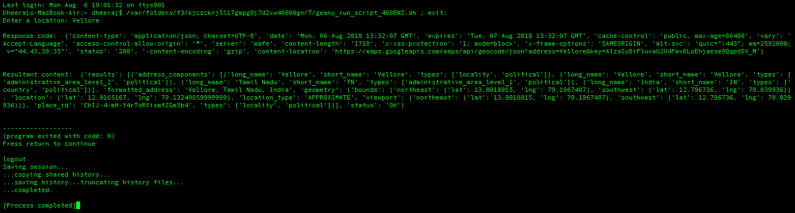
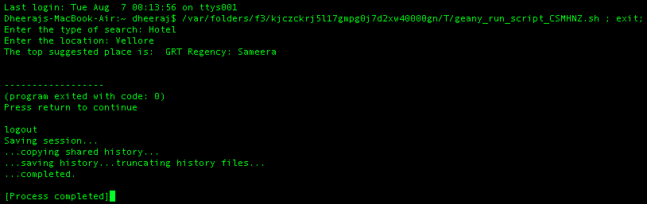
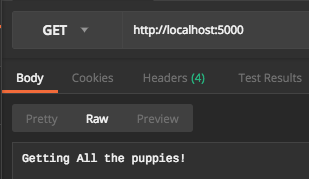
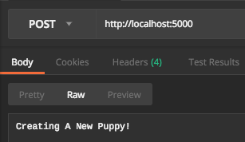
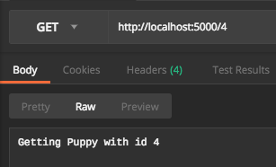

# Designing-RESTful-APIs
Course content part of the udacity course on "**Designing RESTful APIs**".

## Setting up
The tutorial can be followed by installing the required dependencies from the file: ***requirements.txt***. This can be done by using the following code snippet:

```pip3 install -r requirements.txt```

## Introduction
Web APIs have allowed developers to gain more control over an application leading to much more customizations. An example of a company heavily dependent on APIs is Twilio. Web APIs usually work on the Application layer of the OSI model.

## REST
REST refers to REpresentational State Transfer protocol. It uses HTTP verbs for the management of resources and can use any type of message format. The stateless architecture allows for much more scalability.

## REST constraints
1. The architecture is divided into server-client.
2. The activity is stateless since it does not retain any type of information.
3. The response should be cacheable in case the response has not changed over time.
4. It must have a uniform interface for any kind of information.
5. It must follow a layered type of system in which the client only interacts with the point of contact.
6. Code on demand is an optional constraint in RESTful architecture.

## HTTP Request
It is always a "pull protocol". The major componenents of a HTTP request are header and body (optional). The headers consists of the request line and request headers (optional). The request headers are in the form of a name-value pair.

## HTTP Response
The header consists of a status line - HTTP version, status code and reason phrase. 

## Postman
Postman is a great tool for prototyping APIs, and it also has some powerful testing features. It can be downloaded from [here](https://www.getpostman.com/).

## Flask tips
1. Flask always requires a return type to be specified in all the different app routes.
2. Import all required libraries such as Jsonify or requests before using them.

## Examples
1. Geocode API


2. API mashup (Foursquare + Geocode)


3. Different parameters for API endpoint <br>
    
