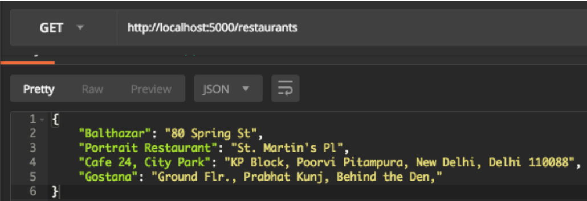

# Designing-RESTful-APIs
Exercises as part of the udacity course at "**[Designing RESTful APIs](https://in.udacity.com/course/designing-restful-apis--ud388)**".

## Setting up
The tutorial can be followed by installing the required dependencies from the file: ***requirements.txt***. This can be done by using the following code snippet:

```pip3 install -r requirements.txt```

## Introduction
Web APIs have allowed developers to gain more control over an application leading to much more customizations. An example of a company heavily dependent on APIs is Twilio. Web APIs usually work on the Application layer of the OSI model.

## REST
REST refers to REpresentational State Transfer protocol. It uses HTTP verbs for the management of resources and can use any type of message format. The stateless architecture allows for much more scalability.

## REST constraints
1. The architecture is divided into server-client.
2. The activity is stateless since it does not retain any type of information.
3. The response should be cacheable in case the response has not changed over time.
4. It must have a uniform interface for any kind of information.
5. It must follow a layered type of system in which the client only interacts with the point of contact.
6. Code on demand is an optional constraint in RESTful architecture.

## HTTP Request
It is always a "pull protocol". The major componenents of a HTTP request are header and body (optional). The headers consists of the request line and request headers (optional). The request headers are in the form of a name-value pair.

## HTTP Response
The header consists of a status line - HTTP version, status code and reason phrase. 

## Postman
Postman is a great tool for prototyping APIs, and it also has some powerful testing features. It can be downloaded from [here](https://www.getpostman.com/).

## API Mashups
### Lesson 2 
This mashup consists of a Python script which takes in a location and the type of search to return the best result to the user with the use of Gecoding and Foursquare API.

### Lesson 3
The functionalities include:
1. POST endpoint at '/restaurants' which takes the location and meal type, the result is then stored in a local DB file. 
2. GET endpoint at '/restaurants' returns all the stored locations from the local DB file.
 
### Lesson 4
This lesson deals with the improving of security and access control for the API endpoints. The files have the following implemented features:
1. The first file deals with the creating of user, viewing the details and providing the modification functionality to only logged-in users using Basic Auth.
2. The second file handles the generation and verification of tokens using the 'itsdangerous' library. 
3. The third file deals with the situation of a rate limiting exercise.

### Lesson 5
This lesson covers some of the tips to write developer-friendly APIs. Some of the suggested tips include:
1. The documentation should be easy to navigate and aesthetically pleasing.
2. The API URL should be easy to understand and not cause any additional confusion.
3. Some of the HTTP methods such as HEAD are used by search engines, therefore should only provide information.
4. A good API should make use of status codes.
5. Properly formatted error messages should be provided.
6. Different versions of the API can help to transition between various updates in the API over time. 

## API tips
1. Flask always requires a return type to be specified in all the different app routes.
2. Import all required libraries such as Jsonify or requests before using them.
3. Primary key needs to be defined for any table in SQL alchemy.
4. 'g' is a container provided by Flask which allows to store information for the lifetime of a request.
5. Static methods can be used when you don't want to access the parameters in an instance of a class.

## Examples
1. Geocode API


2. API mashup (Foursquare + Geocode)


3. Different parameters for API endpoint <br>
    
  
4. API mashup (Foursquare + Geocode + SQLAlchemy) <br>
   
